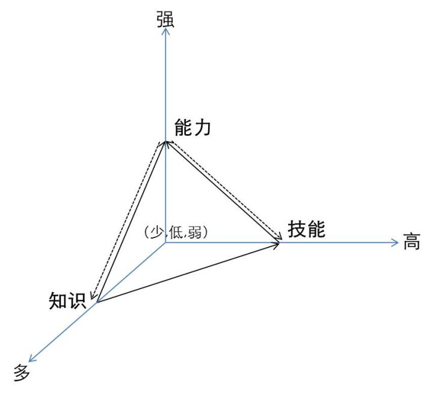

| ✍️ Tangxt | ⏳ 2020-07-26 | 🏷️ faq |

# ★FAQ

## 1、转载他人文章、回答的目的？

该文章、回答，会对我已有的认知产生变化，或者说就像这句话所说的那样：

> 给你自己写一部宪法，每当你遇到改变价值观的事情，就修改一次

话说，什么是价值观呢？

> 价值观就是你认为什么是有价值的，是值得的，重要的观点

如：

- 我认为成就感比自由更加重要
- 花那么多钱买 surfacebook 不值得
- 姑娘的温柔贤惠比漂亮更有意义

再比如：

- 「个人成长」在 xxx 的价值观里排名第一，每当 xxx 做一些让自己成长的决定，自己都会感到忠于内心的快乐

注意：价值观是会不断调整的，虽然有人说到「凡是会动摇的价值观都是不是自己的价值观」 -> 或许，人生的意义就在于养成自己的价值观，一旦价值观形成了，或者这辈子也就活到头了……

所以，我觉得这篇文章、这个回答是有价值的，那么我就会转载之……

➹：[个人知识管理如何做好分类管理，便于后面的学习利用？ - 雨荷在香港的回答 - 知乎](https://www.zhihu.com/question/19621305/answer/885837792)

➹：[什么是价值观，价值观有对错好坏之分吗？ - 达达手写的回答 - 知乎](https://www.zhihu.com/question/19759378/answer/70254268)

## 2、知识、技能、能力 -> 三者联系？

---

**知识是懂，技能是做，能力是成。**

知识是懂得为什么，技能是知道如何做，能力是能够做成功。

有知识，可以更高效灵活的掌握技能；多一项技能，就多一分能力；除了知识技能，能力还包括性格，体力，口才，天赋，是个综合指标。

能力是面向结果的，想做的能成，想要的能有，就可以说是有能力。

---

技能是能力的一种，运用技术的能力。

除技术之外，能力还包括：学习能力，理解能力，举一反三的能力，推理能力，表述能力，创造力；说服别人的能力，表达感情的能力，克制与欺骗的能力，爱与被爱的能力。

力需要施力者和受力者，知识通过能力表现。

我们永远只能看到别人的表现，却可以从表现中推断出其知识和能力。

---

- 知识就是具体掌握的信息
- 技能是指需要进行练习才能提高的
- 能力是指面对超级纷繁复杂的情况下能体现出来的

---

知道，做到，得到

---

---

举一个小例子，一个人识字，会一些知识，比如旅游知识，他想写成一篇文章。

那他还得会什么？-> 得会打字吧，得会排版吧。这是技能。

但你如何写成文章，除了会打字，更需要有逻辑、判断决策、语言表达等能力作为支撑，才能成文。这是能力。

你写的文章表达的观点，是积极、正能量的，还是愤世嫉俗的，是有责任感的，还是随口胡言，这关乎一个人的素养本身。这是素养。

---

➹：[能力与知识、技能三者之间的区别与联系是什么？ - ze ran的回答 - 知乎](https://www.zhihu.com/question/22475646/answer/88808587)

➹：[知识、能力和态度你更看重哪一个，说明一下原因? - 知乎](https://www.zhihu.com/question/330775203)